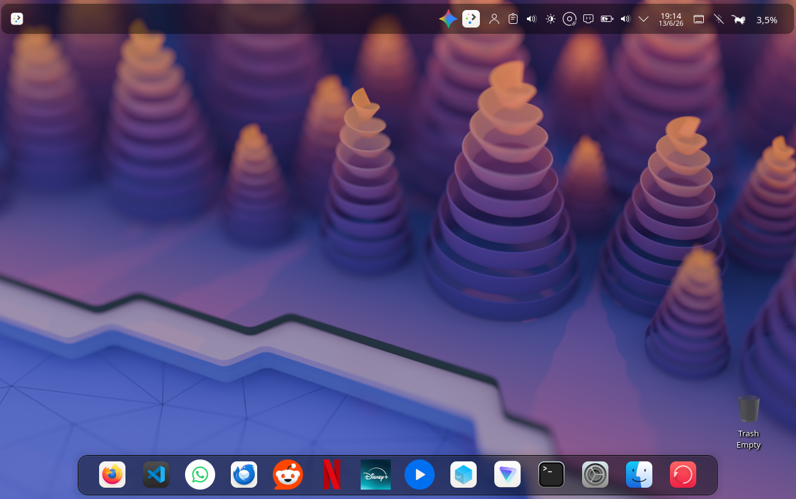

# vArch-OS

### Presenting vArch-OS

Encrypted

Password: [Password](step-by-step.md#encrypt-the-partition)

Your hostname: [Hostname](step-by-step.md#set-you-own-hostname)

User: [Create your own user](step-by-step.md#create-your-own-user)

Change UUID: [UUID](./step-by-step.md#configure-grub)

### Why vArch-OS

encrypted, secure

KDE-plasma

Web apps

### Interface:

