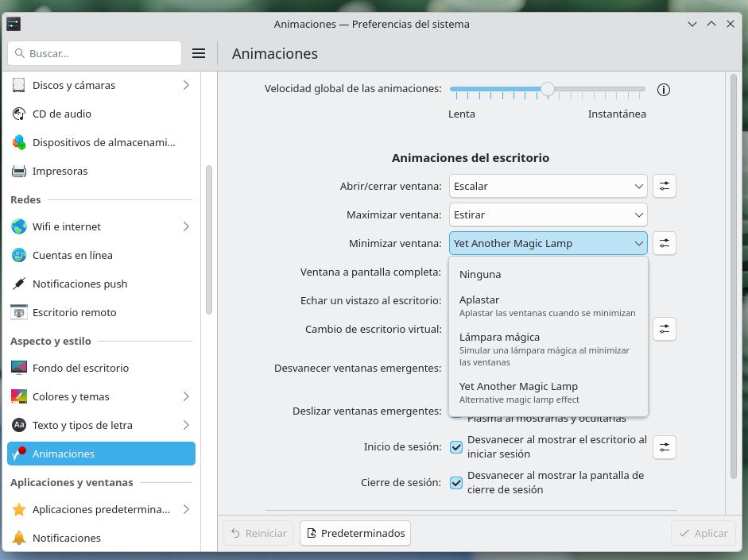
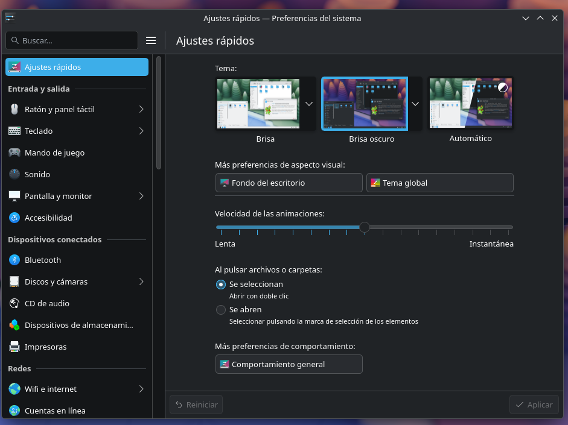
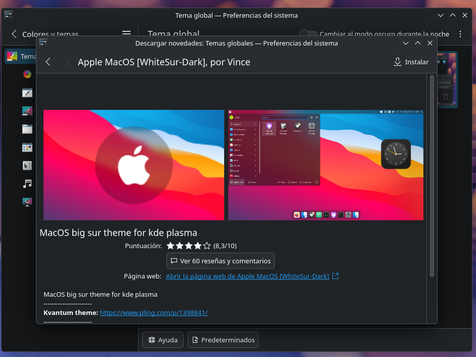
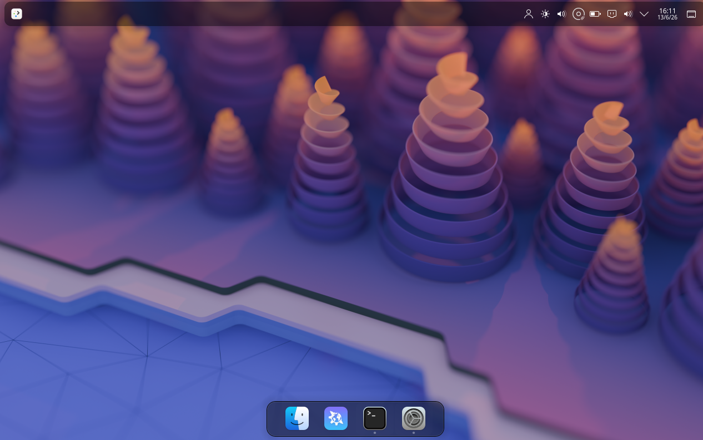
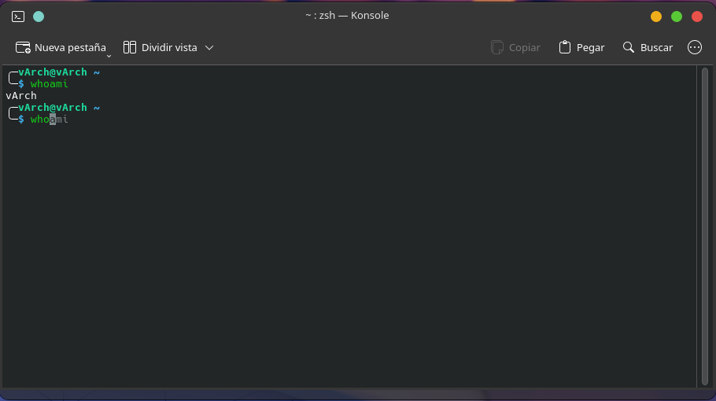
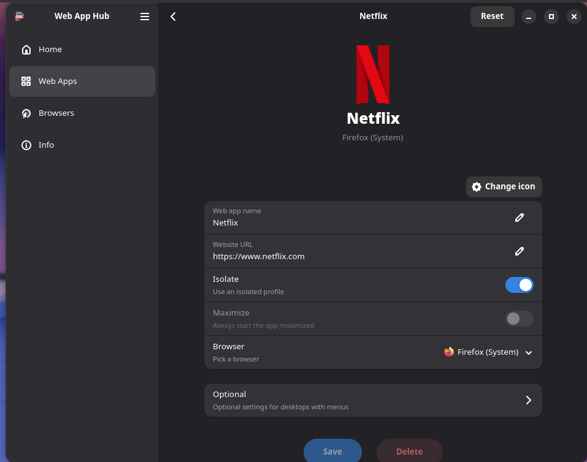
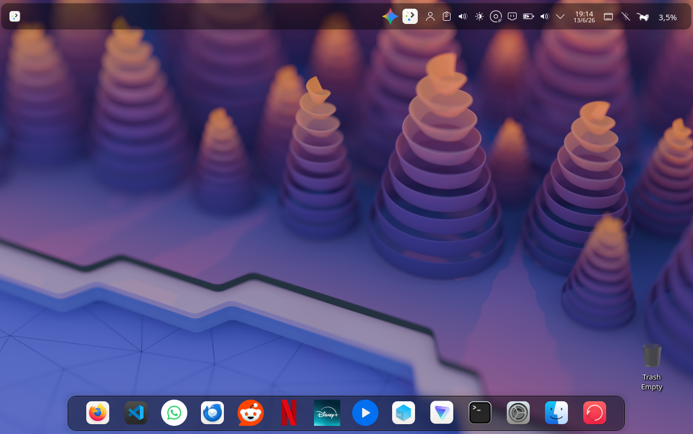

# Desktop Customization:

### Booting:

- Once booted you should see the "GRUB":


- Enter your password:


- You are in:


---

### Connecting to Internet:

- You have to enable NetworkManager:
```bash
sudo systemctl enable NetworkManager && sudo systemctl start NetworkManager
```

- Test Internet Connection:
```bash
ping -c 3 google.com
```

---

### Starting bluetooth modules:
```bash
sudo modprobe btusb && sudo systemctl start blueetooth && sudo systemctl enable blueetooth

---

### Installing video drivers:

- First you need to edit you pacman settings file:
- Remove the "#" on Multilib repository: /etc/pacman.conf
```txt
[multilib]
Include = /etc/pacman.d/mirrorlist
```

- Update:
```bash
sudo pacman -Syu && sudo pacman -S mesa lib32-mesa vulkan-intel intel-media-driver
```

---

### Installing audio drivers:

```bash
sudo pacman -S pipewire pipewire-alsa pipewire-pulse wireplumber
```

---

### Installing kde-plasma desktop environment:

- Install ***plasma-meta***, this is because "meta" keeps updating unlike plasma.

```bash
sudo pacman -S plasma-meta

# Then choose option 1: qt6-multimedia-ffmpeg

# then choose option 2: pipewire-jack

# Then choose noto-fonts.
```

- Press enter to install.

- Now the kde-applications:
```bash
sudo pacman -S kde-applications

# On the first option select = ALL (ENTER)

# On the second question choose 1.

# On the third one choose 1.

# On the fourth one choose 30 (English)
```
- Login manager:
```bash
sudo pacman -S plasma-login-manager && sudo systemctl enable plasmalogin
```

- Reiniciar amb ***"reboot"***

---

### Initial Interface:

- The initial interface is thisone:


### Custom the interface:

- First I installed some things:
```bash
sudo pacman -S zsh git --noconfirm; \
sh -c "$(curl -fsSL https://raw.githubusercontent.com/ohmyzsh/ohmyzsh/master/tools/install.sh)" "" --unattended; \
git clone https://github.com/zsh-users/zsh-autosuggestions ${ZSH_CUSTOM:-~/.oh-my-zsh/custom}/plugins/zsh-autosuggestions; \
git clone https://github.com/zsh-users/zsh-history-substring-search ${ZSH_CUSTOM:-~/.oh-my-zsh/custom}/plugins/zsh-history-substring-search; \
git clone https://github.com/zsh-users/zsh-syntax-highlighting ${ZSH_CUSTOM:-~/.oh-my-zsh/custom}/plugins/zsh-syntax-highlighting; \
sed -i 's/plugins=(git)/plugins=(git zsh-autosuggestions zsh-history-substring-search zsh-syntax-highlighting)/' ~/.zshrc; \
echo -e "\nbindkey '^[[A' history-substring-search-up\nbindkey '^[[B' history-substring-search-down" >> ~/.zshrc; \
sed -i 's/ZSH_THEME="robbyrussell"/ZSH_THEME="bira"/' ~/.zshrc; \
sudo pacman -S thunderbird firefox code virtualbox virtualbox-host-dkms timeshift proton-vpn-gtk-app --noconfirm; \
sudo pacman -Rns falkon --noconfirm; \
sudo pacman -S \
    base-devel \
    cmake \
    extra-cmake-modules \
    kwin \
    kconfig \
    kconfigwidgets \
    kcmutils \
    kcoreaddons \
    kwindowsystem \
    qt6-base \
    libdrm; \
git clone https://github.com/Si13n7/kwin-effects-yet-another-magic-lamp-reloaded.git
cd kwin-effects-yet-another-magic-lamp-reloaded
mkdir build && cd build
cmake .. \
    -DCMAKE_BUILD_TYPE=Release \
    -DCMAKE_INSTALL_PREFIX=/usr
make
sudo make install; \
exec zsh
```

- Once this script executed load the effect:


VIDEO AQUI

- I selected these themes:


- And installed those:


- It is taking shape:




- Add some plugins:
    - Gemini (must set your Google API in config (right click on it))
    - CPU cat
    - Bluetooth
    - Apps Interface

- Install web app hub to use web like apps. Ex: Netflix.



- Final shape:

<h2>Before:</h2>


<h2>After:</h2>

