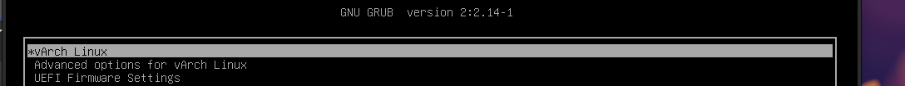
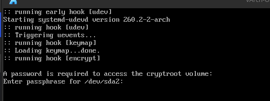
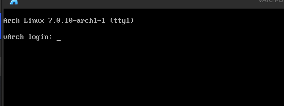
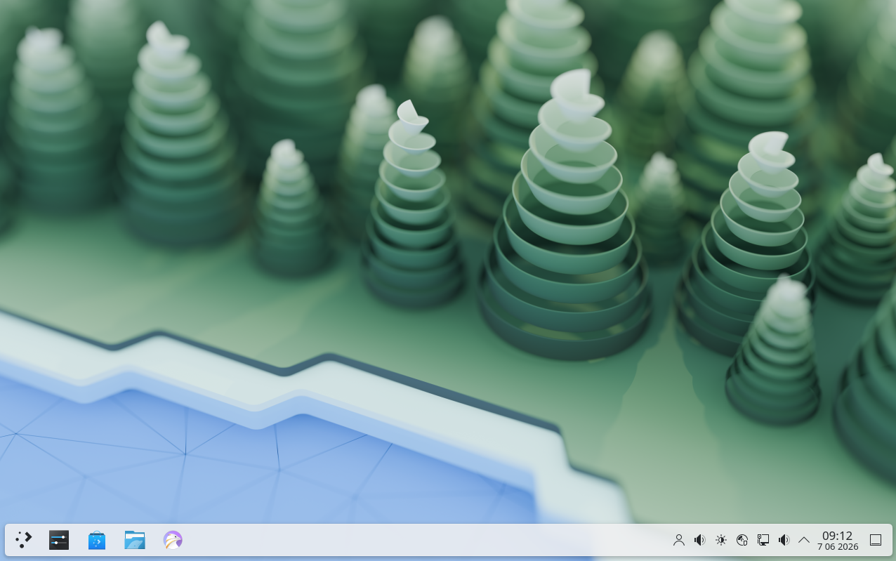
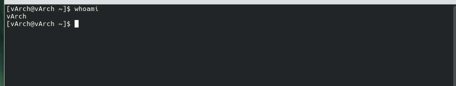

# Desktop Customization:

### Booting:

- Once booted you should see the "GRUB":



- Enter your password:



- You are in:



---

### Connecting to Internet:

- You have to enable NetworkManager:
```bash
sudo systemctl enable NetworkManager && sudo systemctl start NetworkManager
```

- Test Internet Connection:
```bash
ping -c 3 google.com
```

---

### Installing video drivers:

- First you need to edit you pacman settings file:
- Remove the "#" on Multilib repository: /etc/pacman.conf
```txt
[multilib]
Include = /etc/pacman.d/mirrorlist
```

- Update:
```bash
sudo pacman -Syu && sudo pacman -S mesa lib32-mesa vulkan-intel intel-media-driver
```

---

### Installing audio drivers:

```bash
sudo pacman -S pipewire pipewire-alsa pipewire-pulse wireplumber
```

---

### Installing kde-plasma desktop environment:

- Install ***plasma-meta***, this is because "meta" keeps updating unlike plasma.

```bash
sudo pacman -S plasma-meta

# Then choose option 1: qt6-multimedia-ffmpeg

# then choose option 2: pipewire-jack

# Then choose noto-fonts.
```

- Press enter to install.

- Now the kde-applications:
```bash
sudo pacman -S kde-applications

# On the first option select = ALL (ENTER)

# On the second question choose 1.

# On the third one choose 1.

# On the fourth one choose 30 (English)
```
- Login manager:
```bash
sudo pacman -S plasma-login-manager && sudo systemctl enable plasmalogin
```

- Reiniciar amb ***"reboot"***

---

### Initial Interface:

- You can do this with the script: [init-install.sh](init-install.sh)





### Custom the interface:

- There is some customizations you could do with the script: [init install](init-install.sh)
