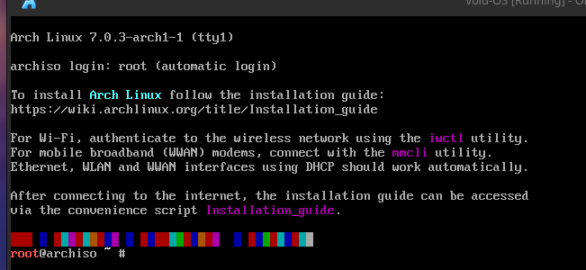

# Step by Step:

Before this, the requirements that it had been used for this installation are:
- x64 bit
- 4CPU's
- 4GB RAM
- 8GB Storage

---

### Downloading ISO:
    - In this case I downloaded the Spanish version: [Link](https://mirror.es.cdn-perfprod.com/archlinux/iso/2026.05.01/archlinux-2026.05.01-x86_64.iso)
    - If you want to check its hash: [b2sums.txt](https://archlinux.org/iso/2026.05.01/b2sums.txt)
```bash
# Go to downloads and check the hash:
b2sum -c b2sums.txt 
```
-
    -  Expected output:
```txt
archlinux-2026.05.01-x86_64.iso: OK
```

- Put the ISO in your pen drive and make it booteable. You can see a few tutorials in the Internet.

- Initiate it from the BIOS.

- Once in the GRUB select the first option.

---

### Once booted, it will display the welcome screen giving you the link of [Arch Linux Wiki](https://wiki.archlinux.org/title/Installation_guide). All the procediment will be from there:



- Now you configure your keyboard: 
```bash
# List Keys:
localectl list-keymaps

# Select keymap. Ex:
loadkeys es
```

---

### Configure Internet:

- Now if you don't have Internet, plug in the Ethernet cable (jump to setup [System Clock](#system-clock)), or configure Wi-Fi:

    - Know you network device name:
```bash
ip link

# Look at the output: ex: enp0s3
```

-   - Unblock the network devices:
```bash
# List them:
rfkill

# Unblock them: Ex:
rfkill unblock wlan
```

-   - Connect using iwctl tool:
```bash
iwctl

# List devices:
[iwd]: device list
[iwd]: device name set-property Powered on
[iwd]: adapter adapter set-property Powered on

# Scan the networks. It won't display any available networks yet:
[iwd]: station name scan

# Now display the scanned networks:
[iwd]: station name get-networks

# Connect with its name (SSID):
[iwd]: station name connect SSID

# Put the password
```

-   - Check your ip:
```bash
ip a

# Check Internet connection:
ping google.com
```

---

### System Clock
- Using **timedatectl**
```bash
# Ex: Madrid / Europe:
timedatectl set-timezone Europe/Madrid
```

---

### Partitioning:

- Now the important and the risky part: **Partitioning disk**:
    - We will do /boot/ partition and assign it 1GB, then the rest of the space in /.
    - List the current partitions:
```bash
# See the endpoints
fdisk -l # Results ex: /dev/sdx

# Do the partitions:
fdisk /dev/sdx # Your partition name

# Create new partition table:

Command (m for help): g

# Create the table /boot:
Parition number (1-128, default 1): 1
First sector (2048-rest, default 2048): 2048
Last sector, +/-sectors or +/-size{K,M,G,T,P} (2048-rest, default rest): +1G # Set 1GB on /boot
```

-   - Same with /: Press enter repetitively

    - Partitions types: Set partition 1 (/boot) to an EFI partition:
```bash
Command (m for help): t

Parition number (1,2, default 2): 1
Partition type or alias (type L to list all): EFI System

# Check the partitions:
Command (m for help): p

# Write the results:
Command (m for help): w
```

- If you want /swap you could configure it but then the quantity would be fixed, instead, you may want to make it with a config file: [Link](https://wiki.archlinux.org/title/Swap)

---

### Formatting partitions:

**!!! Be careful, at this step, the changes will be permanent !!!**

- Format /boot in FAT32 file system:

```bash
# List the partitions:
fdisk -l

# Format /boot
mkfs.vfat -F 32 /dev/sdx1

# Same with /
mkfs.ext4 /dev/sdx2
```

### Mount the file system:

```bash
# Mount / to /mnt:
mount /dev/sdx2 /mnt

# Create the /boot in /mnt
mkdir -p /mnt/boot

# Mount /boot
mount /dev/sdx1 /mnt/boot
```

- !!! Check the order because it's important !!!

---

### Installation:

- Install some packages:
```bash
# !!! IMPORTANT !!!
# If you have Intel then install intel-ucode 
# If you have AMD then install: amd-ucode

pacstrap -K /mnt base linux linux-firmware intel-ucode nano vim man-pages man-db bluez-deprecated-tools bluez-utils bluez networkmanager sof-firmware
```
- You are invited you install you own tools, this is only an initial ones.

---

### Configure the system:

- You have to create an fstab file to mount your drive in boot.

```bash
genfstab -U /mnt >> /mnt/etc/fstab
```

---

### Chroot:

- Now for participi you will chroot from your "temporal" drive /mnt:
```bash
arch-chroot /mnt
```
- !!! Congrats you are now in you terminal !!!

